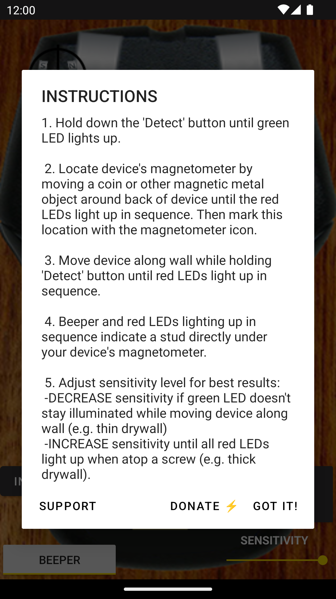

# StudFinder Android

[](LICENSE)

Free, open-source, ad-free Android stud finder app. Uses the device magnetometer to detect metal screws/nails inside wall studs.

- No ads, no analytics, no crash reporting, no Google Play Services
- Fully offline — no network permissions
- Distributed via [F-Droid](https://f-droid.org) (submission in progress)
- Source available at [github.com/clankwright/StudFinderAndroid](https://github.com/clankwright/StudFinderAndroid)

## Screenshots

<p>
  
  
  
  
</p>

## Build

```bash
./gradlew assembleDebug
```

Release builds require `app/release.keystore.properties` (gitignored) pointing at the signing keystore.

## License

Apache License 2.0 — see [LICENSE](LICENSE).
